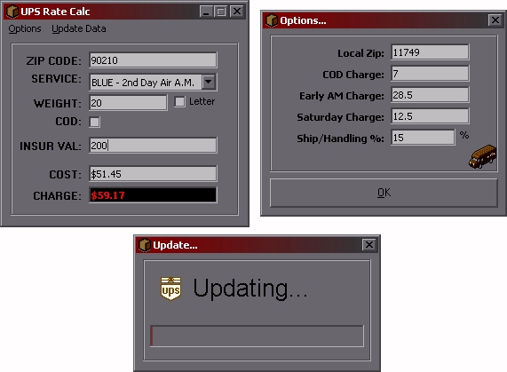



## UPS Rate Calc

### Description

This program will give you the cost of shipping something via UPS from your location. All you need to do is update it with your Zip and start shipping. It gets the latest Zones/Rates from UPS's web site.
 
### More Info
 

             |
---                |---
**Submitted On**   |2003-01-08 12:02:20
**By**             |[Terripan Studio](https://github.com/Planet-Source-Code/PSCIndex/blob/master/ByAuthor/terripan-studio.md)
**Level**          |Intermediate
**User Rating**    |5.0 (25 globes from 5 users)
**Compatibility**  |VB 5\.0, VB 6\.0
**Category**       |[Complete Applications](https://github.com/Planet-Source-Code/PSCIndex/blob/master/ByCategory/complete-applications__1-27.md)
**World**          |[Visual Basic](https://github.com/Planet-Source-Code/PSCIndex/blob/master/ByWorld/visual-basic.md)
**Archive File**   |[UPS\_Rate\_C152594182003\.zip](https://github.com/Planet-Source-Code/terripan-studio-ups-rate-calc__1-42274/archive/master.zip)

